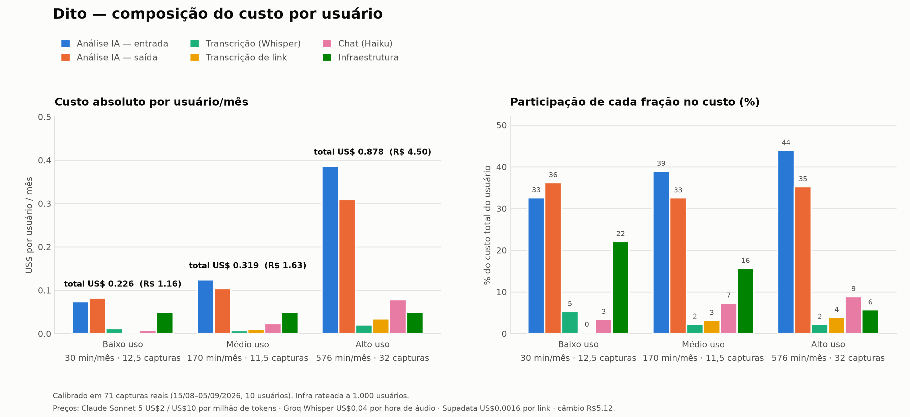

# Dito — Política de preços, benefícios e mecânica de convite

**Data:** 05/09/2026 · **Base:** 71 capturas reais de 10 usuários (15/08 a 05/09/2026)

---

## 1. Resposta curta

| | **Grátis** | **Iniciante** | **Avançado** |
|---|---|---|---|
| **Mensal** | — | **R$ 19,90** | **R$ 39,90** |
| **Anual** | — | **R$ 199** (R$ 16,58/mês) | **R$ 399** (R$ 33,25/mês) |
| **Minutos/mês** | **120** (2h) | **600** (10h) | **2.000** (33h) |
| **Capturas/mês** | 30 | 120 | 200 |
| Custo real medido | R$ 0,94 | R$ 1,38 | R$ 4,22 |
| Margem no uso real | — | **92%** | **88%** |
| Margem no pior caso | — | 39% | 31% |

**Convite:** **60 minutos para quem convida e 60 para quem entra**, limitado a **5 convites premiados por mês**.

O anual é **10× o mensal** (2 meses grátis). É o desconto padrão do mercado, e aqui ele se paga sozinho: antecipa caixa e corta a rotatividade, que é o que realmente machuca num app de R$ 20.

---

## 2. De onde vieram os números

Puxei o histórico real do Supabase: **1.071 eventos, 94 capturas registradas**. Descartei **23 linhas sintéticas** (todas com exatamente `tok_in=100, tok_out=200, duração=2,00 min`, de um único usuário em 03/09) — restaram **71 capturas reais de 10 usuários**.

Os dados mostram uma quebra de regime em **31/08/2026**: o prompt de extração cresceu de ~450 para ~2.450 tokens fixos. Só o regime atual vale para custo.

**Modelo de tokens ajustado sobre os dados reais:**

```
tokens de entrada = 2.473 + 198 × minutos      (R² = 0,973)
tokens de saída   =   607 +  20 × minutos
```

Validei o modelo de trás para frente: aplicado aos links do YouTube, ele devolve durações implícitas de 8, 28, 39, 52 e 61 minutos — exatamente a cara de vídeos reais. O ajuste está de pé.

**Preços unitários usados:**

| Item | Preço | Fonte |
|---|---|---|
| Claude Sonnet 5 (extração) | US$ 2 / US$ 10 por milhão de tokens | Anthropic |
| Claude Haiku 4.5 (chat) | US$ 1 / US$ 5 por milhão | Anthropic |
| Groq `whisper-large-v3-turbo` | US$ 0,04 por hora de áudio | Groq |
| Supadata (transcrição de link) | 1 crédito ≈ US$ 0,0016 (plano Mega) | Supadata |
| Render + Supabase | US$ 7 → 1.249/mês, em degraus | Render / Supabase |
| Play Store (Brasil) | 15% até set/2027 | Google |
| Câmbio | R$ 5,12 | — |

**O que eu não consegui fazer:** não há chave da Anthropic nem da Groq neste ambiente, então **não rodei chamadas reais de API**. Em compensação, os 71 eventos reais já trazem `input_tokens`, `output_tokens` e `audio_seconds` medidos em produção — que é um dado melhor do que um teste sintético. Consultas à tabela `sessions` (onde ficam as transcrições) foram bloqueadas pelo sandbox; contornei derivando tokens/minuto dos próprios eventos.

---

## 3. Custo por usuário



### 3.1 Os três cenários

| | **Baixo uso** | **Médio uso** | **Alto uso** |
|---|---|---|---|
| Minutos/mês | 30 | 170 | 576 |
| Capturas/mês | 12,5 | 11,5 | 32 |
| Perfil | áudios curtos de WhatsApp | a mediana observada | o topo observado |
| **Custo total/mês** | **US$ 0,226 (R$ 1,16)** | **US$ 0,319 (R$ 1,63)** | **US$ 0,878 (R$ 4,50)** |

### 3.2 Como cada fração evolui

| Fração | Baixo | Médio | Alto |
|---|---|---|---|
| Análise IA — entrada | 33% | 39% | 44% |
| Análise IA — saída | 36% | 33% | 35% |
| Transcrição (Whisper) | 5% | 2% | 2% |
| Transcrição de link | 0% | 3% | 4% |
| Chat (Haiku) | 3% | 7% | 9% |
| Infraestrutura | 22% | 16% | 6% |

**Três leituras que mudam decisão:**

1. **A IA é ~70-79% da conta; a transcrição é 2-5%.** A intuição natural é que transcrever áudio seja o custo — não é. O Groq Whisper é praticamente de graça (US$ 0,04/hora). Quem custa é o Claude lendo a transcrição e escrevendo os tópicos. Otimizar transcrição não move o ponteiro; otimizar o prompt de extração move.

2. **Infra domina no usuário leve e some no pesado** (22% → 6%). É custo fixo rateado: escala resolve sozinho.

3. **96% dos minutos consumidos vêm de links do YouTube**, não de gravações. A média é de 24,3 min por link contra 2,2 min por gravação. O produto que vocês têm hoje é, na prática, um resumidor de vídeo — e isso é ótimo para a margem, porque link não paga Whisper.

### 3.3 O achado que mais importa: **minuto não é uma unidade de custo estável**

Cada captura paga **2.473 tokens fixos de prompt**, independente do tamanho. Isso significa que 1.000 minutos de saldo custam coisas radicalmente diferentes conforme o tamanho das capturas:

| 1.000 minutos entregues como… | Capturas | Custo |
|---|---|---|
| áudios de WhatsApp (1,5 min) | 667 | **R$ 46,00** |
| áudios de 5 min | 200 | R$ 15,94 |
| vídeos de 25 min | 40 | R$ 5,63 |
| aulas de 60 min | 17 | **R$ 4,13** |

**Uma variação de 11×.** Sem proteção, um assinante do Iniciante que gastasse os 600 minutos todos em áudios curtos custaria **R$ 26,44** contra R$ 17,51 de receita líquida — **margem negativa**. No Avançado a conta ficaria em −R$ 53.

**Por isso os planos têm teto duplo: minutos _e_ capturas.** O limite de capturas nunca incomoda quem usa de verdade (o usuário mediano faz 11,5 capturas/mês; o teto do Iniciante é 120), mas fecha o buraco do abuso.

| Plano | Teto | Pior caso possível | Margem no pior caso (mensal / anual) |
|---|---|---|---|
| Grátis | 120 min / 30 capturas | R$ 2,47 | — |
| Iniciante | 600 min / 120 capturas | R$ 10,65 | 39% / 27% |
| Avançado | 2.000 min / 200 capturas | R$ 24,21 | 31% / 17% |

---

## 4. Política de preços sob crescimento

Simulei três misturas de plano, com dormência realista (usuário grátis ativo só 20-30% dos meses; pagante 85-90%) e 35% de adesão ao anual.

| Mistura | Grátis | Iniciante | Avançado | Ativos entre os grátis |
|---|---|---|---|---|
| Pessimista | 95% | 4% | 1% | 20% |
| Realista | 90% | 7% | 3% | 25% |
| Otimista | 80% | 13% | 7% | 30% |

**Resultado (receita e lucro em US$/mês):**

| Cenário | Usuários | Pagantes | Receita | Custo | Custo dos grátis | Lucro | Margem | ARPU |
|---|---|---|---|---|---|---|---|---|
| Pessimista | 500 | 25 | 96,70 | 71,18 | 12,88 | 25,52 | 26% | R$ 0,99 |
| Pessimista | 2.000 | 100 | 386,82 | 134,72 | 51,52 | 252,10 | 65% | R$ 0,99 |
| Pessimista | 10.000 | 500 | 1.934 | 554 | 258 | 1.380 | 71% | R$ 0,99 |
| Pessimista | 50.000 | 2.500 | 9.670 | 3.367 | 1.288 | 6.303 | 65% | R$ 0,99 |
| **Realista** | 500 | 50 | 209,59 | 84,44 | 15,25 | 125,16 | 60% | R$ 2,15 |
| **Realista** | 2.000 | 200 | 838,38 | 187,75 | 61,01 | 650,63 | 78% | R$ 2,15 |
| **Realista** | **10.000** | **1.000** | **4.192** | **819** | **305** | **3.373** | **81%** | **R$ 2,15** |
| **Realista** | 50.000 | 5.000 | 20.959 | 4.693 | 1.525 | 16.267 | 78% | R$ 2,15 |
| Otimista | 500 | 100 | 435,37 | 107,22 | 16,27 | 328,15 | 75% | R$ 4,46 |
| Otimista | 2.000 | 400 | 1.741 | 279 | 65 | 1.463 | 84% | R$ 4,46 |
| Otimista | 10.000 | 2.000 | 8.707 | 1.274 | 325 | 7.433 | 85% | R$ 4,46 |
| Otimista | 50.000 | 10.000 | 43.537 | 6.971 | 1.627 | 36.566 | 84% | R$ 4,46 |

### O que isso quer dizer

**O negócio não é limitado por custo — é limitado por demanda.** Mesmo no cenário pessimista, com 95% de usuários grátis, a margem passa de 65% assim que a infra dilui (a partir de ~2.000 usuários). O único ponto apertado é o começo: com 500 usuários a margem cai para 26% no pessimista, porque os US$ 7-50 de infra ainda pesam.

**Cada pagante carrega os grátis com folga:**

| Cenário | Custo de grátis por pagante |
|---|---|
| Pessimista | R$ 2,64/mês |
| Realista | R$ 1,56/mês |
| Otimista | R$ 0,83/mês |

Contra R$ 17,51 líquidos de um Iniciante. **Sobra muito.** Isso é o que autoriza um plano grátis generoso — a alavanca de crescimento vale mais que o custo.

### Por que R$ 19,90 e R$ 39,90

Os preços **não saem do custo** (o custo é 8% da receita) — saem do que o mercado paga:

- **Referência da categoria:** Otter.ai cobra US$ 8,33/mês no anual (≈ R$ 42/mês) por 1.200 minutos. O Avançado entrega 2.000 minutos por R$ 33,25/mês no anual — **mais generoso e mais barato**.
- **Referência do bolso brasileiro:** Spotify R$ 21,90, Netflix básico R$ 20,90. R$ 19,90 está na faixa em que o brasileiro assina sem pensar muito; R$ 29,90 já exige justificativa.
- **A escada faz sentido:** o Avançado dá 3,3× o volume por 2× o preço. Quem passa de 600 minutos é usuário profissional e aceita a conta.

Testei a grade de preços no cenário realista com 10 mil usuários. Subir o Iniciante de R$ 19,90 para R$ 24,90 aumenta o lucro em 17% **se a conversão não cair** — e ela cai. Como você ainda não tem dados de conversão, o preço certo é o que **maximiza aprendizado**, não o que maximiza margem numa planilha. R$ 19,90 tira o preço da mesa como objeção e deixa você descobrir se o produto converte. Dá para subir depois; descer é muito mais caro.

---

## 5. Quanto dar de benefício

### Grátis: 120 minutos / 30 capturas

Calibrado num ponto específico: **o usuário mediano observado consome 170 min/mês**. Com teto de 120, ele bate no limite — que é exatamente o que você quer. Um grátis que nunca acaba não converte ninguém.

Duas horas é o suficiente para a pessoa entender o valor (umas 5 aulas ou reuniões), e curto o bastante para doer. Custa R$ 0,94/mês no uso real, R$ 2,47 no pior caso.

### Iniciante: 600 minutos / 120 capturas

**3,5× a mediana observada.** A regra aqui é que o assinante nunca deve pensar no saldo — se ele racionar, ele cancela. 10 horas/mês cobre com folga quem usa para trabalho ou faculdade. Custo real: R$ 1,38 (margem de 92%).

### Avançado: 2.000 minutos / 200 capturas

**3,5× o topo observado** (576 min/mês). Mesma lógica, para quem vive dentro do app.

> **Nota sobre o teto de capturas:** apresente como "até 120 capturas por mês", não como limite técnico. Ninguém real esbarra nele — 4 por dia é muito mais do que qualquer usuário atual faz. Ele existe só para que um caso patológico não coma a margem.

---

## 6. Mecânica de convite

**Recomendação: 60 minutos para quem convida + 60 para quem entra, teto de 5 convites premiados por mês.**

### A conta

O valor esperado de um cadastro novo é o LTV do pagante vezes a chance de virar pagante (churn de 8%/mês):

| Cenário | P(virar pagante) | LTV do pagante | **Valor de 1 cadastro** |
|---|---|---|---|
| Pessimista | 5% | R$ 263 | **R$ 13,14** |
| Realista | 10% | R$ 285 | **R$ 28,49** |
| Otimista | 20% | R$ 296 | **R$ 59,18** |

O prêmio de 60 minutos custa **R$ 0,34** se gasto em vídeos longos e **R$ 2,64** no pior caso (áudios curtos). Mesmo no pior caso e no cenário pessimista, **você paga R$ 2,64 por algo que vale R$ 13**. Cobertura de 5× a 22×.

### Por que 60 e não 150

Custo não é a restrição — **canibalização é**. Com 60 min e teto de 5 convites, o usuário grátis mais engajado chega a 120 + 300 = **420 min/mês**, ainda abaixo dos 600 do Iniciante. Ele continua com motivo para assinar.

Com 150 min por convite, três convites já entregam 570 minutos de graça e o Iniciante perde a razão de existir. **O prêmio precisa ser grande o bastante para motivar e pequeno o bastante para não substituir o plano pago.**

### Detalhes que importam

- **Premie os dois lados.** Quem entra por convite com 1 hora extra ativa muito mais do que quem entra no plano padrão, e quem convidou tem um argumento melhor ("você também ganha").
- **Só premie cadastro com verificação** (e-mail confirmado + pelo menos 1 captura). Sem isso a mecânica vira fábrica de contas falsas — e como o prêmio é em minutos, o custo do abuso é real.
- **Os minutos do prêmio devem expirar** junto com o ciclo do mês, como o resto do saldo. Saldo acumulável vira passivo.

---

## 7. O que fazer agora

**Antes de ligar a cobrança:**

1. **Implementar o teto de capturas junto com o de minutos.** É a única coisa nesta análise que protege a margem contra um caso real (usuário de áudios curtos de WhatsApp). Sem isso, o Iniciante pode dar prejuízo.

2. **Testar cache de prompt na extração.** O prompt fixo de 2.473 tokens é idêntico em toda captura e hoje é pago inteiro toda vez. Com cache (leitura a 0,1×), a economia é de **US$ 0,0044 por captura — 23% a 30% do pior caso de cada plano**.
   - O mínimo cacheável do Sonnet 5 é **1.024 tokens**. O `INSIGHTS_INSTRUCTIONS` sozinho tem ~770 — abaixo do mínimo. Com o schema no mesmo prefixo o bloco passa de 2.400 tokens e deve cachear.
   - **Como verificar:** vocês já registram `cache_read_tokens` em `events.props.usage`. Se ele continuar zerado na segunda captura seguida, o cache não pegou — e aí não adianta insistir sem mudar o formato da chamada. O chat já faz isso certo (2.334 tokens de leitura de cache contra 736 de entrada); a extração ainda não.

3. **Instrumentar `duracao_s` nos links.** Hoje link vem com `audio_seconds = 0` e a duração real não é gravada — eu tive que inferir dos tokens. Como link é 96% do consumo, você está cobrando o saldo de uma coisa que não mede diretamente. É uma linha de código e resolve o ponto cego.

**Depois de ligar:**

4. **Medir conversão antes de mexer no preço.** Com 21 cadastros não dá para saber se 10% viram pagantes. Toda a escolha entre pessimista e otimista depende desse número, e ele custa ~90 dias de observação.

---

## Anexo — premissas e limitações

**Premissas assumidas** (mudam o resultado se estiverem erradas):

- Dormência: 20-30% dos grátis ativos por mês; 85-90% dos pagantes. Não medido — os 10 usuários atuais são testadores escolhidos a dedo e não representam público real.
- Churn de 8%/mês no cálculo de LTV. Padrão de app de consumo; não medido.
- 35% de adesão ao plano anual.
- Mix de cobrança 70% Play Store (15%) / 30% web (5%) → taxa efetiva de 12%.
- Câmbio R$ 5,12. Todo o custo é em dólar e toda a receita em real — **uma alta de 20% no dólar tira ~1,5 ponto de margem**, o que é absorvível.

**Limitações honestas:**

- 71 capturas de 10 usuários é uma amostra pequena, concentrada em 3 semanas.
- Não rodei chamadas reais de API (sem chave neste ambiente). Os tokens vêm da telemetria de produção, que é dado real, mas não testei cenários novos (ex.: vídeo de 4h, que dispara o caminho de map-reduce e custa bem mais).
- Vídeos acima de ~3,7 horas (160 mil caracteres) usam map-reduce e custam desproporcionalmente mais. Nenhum caso desses apareceu no histórico. Se o teto do Avançado (2.000 min) permitir vídeos assim, vale medir antes.
- A duração dos links é inferida, não medida (ver ação 3).
